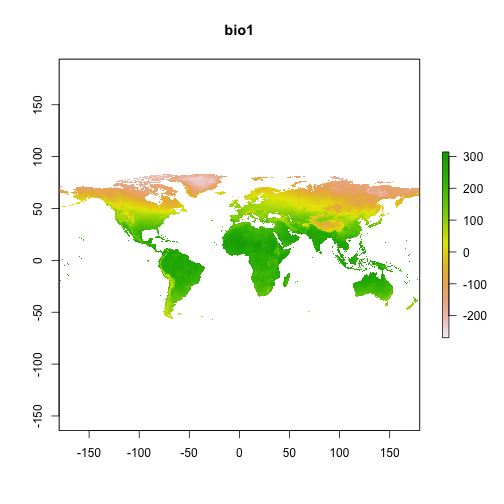

Script to make a map and add points
=========================================

Load libraries


```r
# sessionInfo()

library(raster)
```

```
## Loading required package: sp
```

```r
library(rgdal)  # NOTE: have to have [gdal](http://www.gdal.org/) and [PROJ.4](http://trac.osgeo.org/proj/) install on PATH
```

```
## rgdal: version: 0.8-6, (SVN revision Unversioned directory) Geospatial
## Data Abstraction Library extensions to R successfully loaded Loaded GDAL
## runtime: GDAL 1.9.0, released 2011/12/29 Path to GDAL shared files:
## /Library/Frameworks/R.framework/Versions/2.15/Resources/library/rgdal/gdal
## Loaded PROJ.4 runtime: Rel. 4.8.0, 6 March 2012, [PJ_VERSION: 480] Path to
## PROJ.4 shared files:
## /Library/Frameworks/R.framework/Versions/2.15/Resources/library/rgdal/proj
```

```r
library(dismo)
library(maptools)
```

```
## Loading required package: foreign
```

```
## Loading required package: grid
```

```
## Loading required package: lattice
```

```
## Checking rgeos availability: FALSE Note: when rgeos is not available,
## polygon geometry computations in maptools depend on gpclib, which has a
## restricted licence. It is disabled by default; to enable gpclib, type
## gpclibPermit()
```

```r
library(maps)
library(ggplot2)
```


Get climate data. Use highest scale resolution (10deg) for faster download at large scale. Other options are 5, 2.5 and 0.5 (which requires downloading individual tiles)


```r
w <- getData("worldclim", var = "bio", res = 10)
names(w)
```

```
##  [1] "bio1"  "bio2"  "bio3"  "bio4"  "bio5"  "bio6"  "bio7"  "bio8" 
##  [9] "bio9"  "bio10" "bio11" "bio12" "bio13" "bio14" "bio15" "bio16"
## [17] "bio17" "bio18" "bio19"
```

```r
# Plot first bioclim dimension (MAT) to check download worked
plot(w, 1)
```

 


Load file with location data. Longitude column ('lon') should precede latitude ('lat')


```r
d <- read.csv("Aphaeno2013_sampling_locations.csv")
head(d)
```

```
##               site_name state   lon   lat
## 1  Bradley Public Lands    ME 68.53 44.93
## 2    Kennebec Highlands    ME 69.92 44.57
## 3             Molly Bog    VT 72.64 44.50
## 4           Rugar Woods    NY 73.49 44.49
## 5            East Woods    VT 73.20 44.44
## 6 Merriman State Forest    NH 71.14 44.11
```

```r
str(d)
```

```
## 'data.frame':	26 obs. of  4 variables:
##  $ site_name: Factor w/ 26 levels "Albany Pine Bush",..: 6 15 19 23 9 18 24 3 1 11 ...
##  $ state    : Factor w/ 12 levels "GA","MA","ME",..: 3 3 12 6 12 5 3 5 6 2 ...
##  $ lon      : num  68.5 69.9 72.6 73.5 73.2 ...
##  $ lat      : num  44.9 44.6 44.5 44.5 44.4 ...
```


Extract bioclimatic variables from worldclim data. Note bioclim temperature data is multiplied by 10 (no decimal), so transform by dividing by 10.


```r
# Extract climate values for site lon/lat from bioclim data
dbio1 <- extract(w, d[, c("lon", "lat")])

dbio1 <- cbind(d, dbio1[, 1])
colnames(dbio1)[5] <- "MATx10"
dbio1$MAT <- dbio1$MATx10/10
head(dbio1)
```

```
##               site_name state   lon   lat MATx10  MAT
## 1  Bradley Public Lands    ME 68.53 44.93     99  9.9
## 2    Kennebec Highlands    ME 69.92 44.57     98  9.8
## 3             Molly Bog    VT 72.64 44.50    101 10.1
## 4           Rugar Woods    NY 73.49 44.49     98  9.8
## 5            East Woods    VT 73.20 44.44     99  9.9
## 6 Merriman State Forest    NH 71.14 44.11    104 10.4
```

```r

# Write to file
write.table(dbio1, file = "Aphaen2013_sites_MAT.txt", quote = FALSE, sep = "\t", 
    row.names = FALSE)
```


Plot NorthEastern US and add points for sampling sites. Note MAT is still multiplied by 10.


```r
plot(w, 1, xlim = c(-90, -60), ylim = c(25, 50), axes = TRUE)
points(-dbio1$lon, dbio1$lat, col = "black", pch = 20, cex = 0.75)
```

 


Create same plot using ggplot2, with help from [stackoveflow](http://stackoverflow.com/questions/9422167/how-do-i-plot-a-single-point-on-a-world-map-using-ggplot2)

TODO: need to add MAT to plot....


```r
eUSA <- map_data("state", region = c("florida", "south carolina", "north carolina", 
    "georgia", "virginia", "west virginia", "maryland", "delaware", "new jersey", 
    "rhode island", "new york", "connecticut", "massachusetts", "pennyslvania", 
    "vermont", "new hampshire", "maine", "alabama", "tennessee", "kentucky", 
    "ohio"))

p <- ggplot(legend = FALSE) + geom_path(data = eUSA, aes(x = long, y = lat, 
    group = group)) + theme(panel.background = element_blank()) + theme(panel.grid.major = element_blank()) + 
    theme(panel.grid.minor = element_blank()) + theme(axis.text.x = element_blank(), 
    axis.text.y = element_blank()) + theme(axis.ticks = element_blank()) + xlab("") + 
    ylab("")

# Sites to add to plot:
sites <- d[, c("lon", "lat")]
p <- p + geom_point(data = sites, aes(-lon, lat), colour = "green", size = 4)
p
```

 


Hmmm...looks like points are out of place...probably due to Google Earth giving DD'MM'SS and R plots expecting DD.DDDD

Would be cool to make animated plot showing changes in temperature over past 100 years using something like [this](http://r-nold.blogspot.com/2012/08/provincial-monthly-rainfall-of.html)


